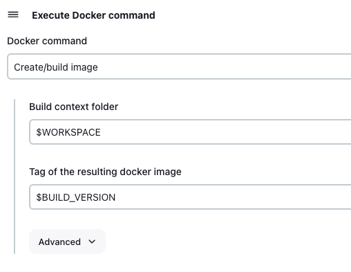

# jenkins配置


```shell
# 创建用户:
useradd docker -g docker
group add 
# 授权
chown -R docker:docker jenkins_home
```


安装插件 gradle , node , docker , version number

docker 配置： unix:///var/run/docker.sock


```tex
BUILD_VERSION
qingsongzu-${BUILD_DATE_FORMATTED,"yyyy-MM-dd"}:1.0.${BUILD_NUMBER}
```




```tex
$WORKSPACE
$BUILD_VERSION
```


```tex
$BUILD_VERSION
registry.cn-hangzhou.aliyuncs.com/zoowayss-imgs/qingsongzu
1.0.$BUILD_NUMBER
```


```tex
registry.cn-hangzhou.aliyuncs.com/zoowayss-imgs/qingsongzu
1.0.$BUILD_NUMBER
registry.cn-hangzhou.aliyuncs.com
```


```tex
registry.cn-hangzhou.aliyuncs.com/zoowayss-imgs/qingsongzu:1.0.$BUILD_NUMBER
```


ssh publisher

```shell
cd /opt/docker/apps/backend/qingsongzu
echo -e "version: '3.9'
services:
  api:
    container_name: qingsongzu-api
    image: registry.cn-hangzhou.aliyuncs.com/zoowayss-imgs/qingsongzu:1.0.$BUILD_NUMBER
    ports:
      - 9099:8080
    volumes:
      - ./data/:/java/data/
    logging:
      driver: json-file
      options:
        max-size: 300m" > docker-compose.yml

docker compose up -d api
```

