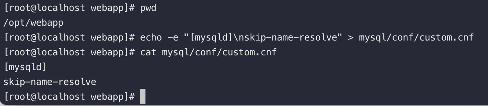

# docker-compose

```shell
curl -qO https://mirror.ghproxy.com/https://raw.githubusercontent.com/zoowayss/docker-compose/master/webapp/docker-compose.yml
```


# mysql

## mysql启动

1. 在 **./mysql/conf** 目录下 新建  **custom.conf** 并写入内容

   > [mysqld]
   > skip-name-resolve

   ```shell
   echo -e "[mysqld]\nskip-name-resolve" > mysql/conf/custom.cnf
   ```




# kafka

   ```shell
   # 启动
   docker compose -f kafka.yml -p kafka up -d
   # 删除
   docker compose -p kafka down
   ```
# nginx

## nginx启动

1. 首先先启动一个nginx容器

   ```shell
   docker compose up nginx -d
   ```

2. 复制容器配置文件到宿主机

   ```shell
   docker cp webapp-nginx:/etc/nginx/conf.d/default.conf ./nginx/conf.d/
   docker cp webapp-nginx:/etc/nginx.conf ./nginx/
   ```

3. 去掉docker-compose.yml 注释，重新启动容器

## nginx 配置文件示例

```nginx
#将所有 /api 开头的请求，全部转发到 backend，并且去掉 /api前缀
location /api {
    rewrite ^/api(.*)$ $1 break;
    proxy_set_header Host $host;
    proxy_set_header X-Real-IP $remote_addr;
    proxy_set_header X-Forwarded-For $proxy_add_x_forwarded_for;
    proxy_pass http://backend;
}
```
